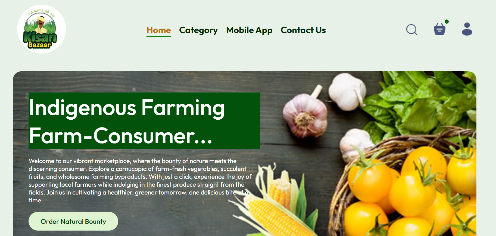

# Kissa-Bazzar
**Motive**: Direct contact between farmers and consumers.



## Project Overview
"Kissa-Bazzar" is a fully functional and mobile-responsive e-commerce website designed to bridge the gap between farmers and consumers. Built using the MERN stack, the platform allows farmers to register and manage their natural farming products, and customers to purchase these products seamlessly.

## Features

### Admin (Farmer) Functionality:
- **Login/Register**: Farmers can log in or register as admins.
- **Product Management**: Farmers can add, update, and delete products with detailed information, images, and pricing.
- **Order Management**: Farmers can view and manage orders placed by customers.

### Customer Functionality:
- **Login/Register**: Customers can sign up or log in to access the platform.
- **Product Browsing**: Customers can view natural farming products across 12 categories:
  1. Fruits
  2. Leafy Vegetables
  3. Vegetables
  4. Milk and Byproducts
  5. Meats
  6. Spices
  7. Pulses
  8. Seeds
  9. Grains
  10. Flowers and Plants
  11. Village Dishes
- **Cart Management**: Customers can add products to the cart.
- **Product Reviews**: Customers can like products and give star reviews.
- **Order Placement**: Customers can place orders and complete payment integration.
- **Order Tracking**: Customers can track the status of their orders.

## Technologies Used

### MongoDB:
- Used as the database to store user information, product details, and order data.
- **Features**: NoSQL database, scalable, high performance.

### Express.js:
- Used to create the backend server and handle API requests.
- **Features**: Fast, minimalistic web framework for Node.js.

### React.js:
- Used to build the frontend user interface.
- **Features**: Component-based architecture, fast rendering with Virtual DOM, and state management with hooks and context API.

### Node.js:
- Used as the runtime environment to execute JavaScript on the server-side.
- **Features**: Event-driven, non-blocking I/O, perfect for building scalable network applications.

## How to Run the Project

### Clone the repository:
```bash
git clone https://github.com/your-username/kissa-bazzar.git
cd kissa-bazzar
This project is licensed under the MIT License.
